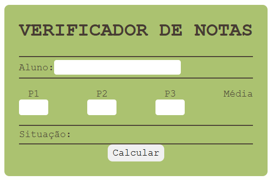

# Calculo De Media

Uma aplicação que calcula a media de 3 notas (p1, p2 e p3), tendo como voltar atras caso alguma informação esteja errada (nome ou nota)

linguagens: HTML, CSS e JS

## Tela

Em cada campo (nome e o das notas) é exigido algo para fazer o calculo. A situação também é informada (se passou ou não).

Caso algum dos campos não esteja preenchidos, um alert ira ser disparado pedindo para que o usuario os preencha. Antes de fazer o calculo e da a media, é perguntado ao usuario se ele deseja continuar com a ação e o pede para verificar suas informações.
